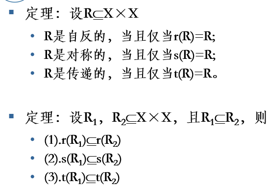
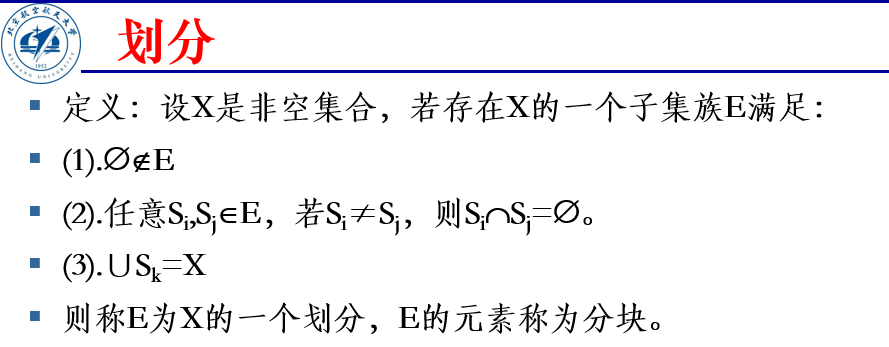
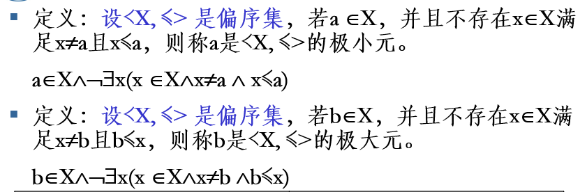
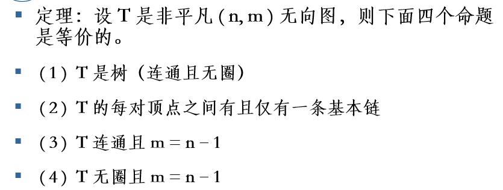
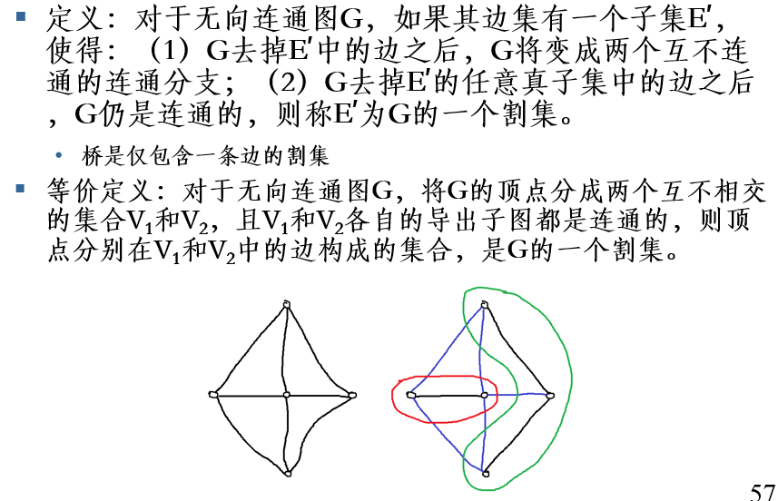

@GradiusTwinbee

42系课程资源：[BUAA-IAI-Course-Sharing (github.com)](https://github.com/BUAA-AI-Research-Course-Sharing)

# 集合

## 数集符号

| 符号  |   含义   |
| :---: | :------: |
|  $N$  | 自然数集 |
| $I/Z$ |  整数集  |
|  $Q$  | 有理数集 |
|  $R$  |  实数集  |
|  $C$  |  复数集  |

## 运算

|  运算  |                 含义                  |
| :----: | :-----------------------------------: |
|   并   |   $A\cup B=\{x|x\in A\or x\in B\}$    |
|   交   |   $A\cap B=\{x|x\in A\and x\in B\}$   |
|   差   |  $A-B=\{x|x\in A\and x\not \in B\}$   |
| 对称差 | $A\oplus B=\{x|x\in A\oplus x\in B\}$ |
|   补   |       $\sim A=\{x|x\not\in A\}$       |

## 关系

|  关系  |                             含义                             |
| :----: | :----------------------------------------------------------: |
|  子集  | $A\subseteq B\iff \forall x\in A(x\in A\rightarrow x\in B)$  |
| 真子集 | $A\subset B\iff \forall x\in A(x\in A\rightarrow x\in B)\and\exist x(x\in B\and x\not \in A)$ |
|  相等  |       $A=B\iff\forall x(x\in A\leftrightarrow x\in B)$       |

## 计数原理

**基数**

集合$A$包含元素的个数称为集合$A$的基数，记作$\#A$、$|A|$.

**计数原理**
$$
|A\cup B|=|A|+|B|-|A\cap B|
$$
这里$A、B$均为有限集合。

**无限集合**

|    类别    |     势     |                             例子                             |
| :--------: | :--------: | :----------------------------------------------------------: |
|  可数集合  | $\aleph_0$ | 整数集、有理数集、自然数集、$\N\times \N$、$\N\times \N\times\N$ |
| 不可数集合 | $\aleph_1$ |             实数集、自然数集的幂集、$\R\times\R$             |

## 幂集

由集合$A$的所有子集构成的集合称为$A$的幂集。
$$
\rho(A)=\{x|x\subseteq A\}
$$
对于有限集合$A$，
$$
|\rho(A)|=2^{|A|}
$$

最后一条不能取等，考虑特例$A=\{1,2\},B=\{1,3\}$.

## 笛卡尔积

$$
A\times B=\{<x,y>|x\in A\and y\in B\}
$$

## 例题

# 关系

## 关系

## 定义域和值域

## 特殊关系

## 运算

|   运算   |                           含义                            |
| :------: | :-------------------------------------------------------: |
| 复合运算 | $R\circ S=\{<x,z>|\exist y(<x,y>\in R\and <y,z>\in S)\} $ |
|  逆运算  |               $R^{-1}=\{<y,x>|<x,y>\in R\}$               |
|  幂运算  |              $R^0=I_x;R^{n+1}=R^{n}\circ R$               |

## 关系特性

|  特性  |                             定义                             |       判定(当且仅当)        |              闭包               |
| :----: | :----------------------------------------------------------: | :-------------------------: | :-----------------------------: |
|  自反  |                 $\forall x\in X,<x,x>\in R$                  |         $I_X\in R$          |        $r(R)=R\cup I_X$         |
| 反自反 |               $\forall x\in X,<x,x>\not\in R$                |     $I_X\cap R=\empty$      |                -                |
|  对称  |      $\forall x,y\in X,<x,y>\in R\rightarrow<y,x>\in R$      |         $R^{-1}=R$          |       $s(R)=R\cup R^{-1}$       |
| 反对称 | $\forall x,y\in X,<x,y>\in R\and <y,x>\in R\rightarrow x=y$  | $R\cap R^{-1}\subseteq I_X$ |                -                |
|  传递  | $\forall x,y,z\in X,<x,y>\in R\and <y,z>\in R\rightarrow <x,z>\in R$ |    $R\circ R\subseteq R$    | $t(R)=\bigcup_{n=1}^\infty R^n$ |

## 闭包

**例题**

证明：

$\Rightarrow$:$\forall (x,z)\in R\circ R$，$\exist y\in A$，使得$(x,y)\in R$，$(y,z)\in R$.

因为$R$是传递的，所以$(x,z)\in R$，得证.

$\Leftarrow$:$\forall (x,y),(y,z)\in R$，有$(x,z)\in R\circ R$.

因为$R\circ R\subseteq R$，所以$(x,z)\in R$，得证.

## 等价关系

**定义**

同时具备自反、对称、传递三个性质。

**等价类**

**等价类性质**

**商集**

**划分**

**例题**

## 序关系

**偏序**

**全序**

**拟序**

**极小元（不存在比它更小）与极大元（不存在比它更大）**

**最小元（每个都比它大）与最大元（每个都比它小）**

**良序**

自然数集是良序集，整数集不是良序集。

良序集一定是全序集，**有限**全序集一定是良序集。

**例题**

# 函数

## 定义

## 函数特性

## 运算

复合运算、逆运算（需要是双射）、幂运算与关系运算定义相同。
$$
h\circ(g\circ f)=(h\circ g)\circ f\\
f\circ I_X=I_Y\circ f=f\\
f^{-1}\circ f=I_X\\
f\circ f^{-1}=I_Y
$$

## 特征函数

## 例题

# 自然数

掌握第一、第二归纳法，证明题可能用到。

掌握可数集、不可数集、势等概念，主要是知道哪些集合可数、哪些不可数（参见第1部分的基数），判断题会出一道。

# 图基本概念

## 偶

## 度

所有点的度之和一定是偶数。

## 同构

出发点是点一一对应，落脚点是边的一一对应。即找到一种关于点的一一对应，刚好让边也一一对应。

## 生成子图

要求子图顶点与原图相同。

## 二部图

## 例题

基础图：有向图将边的方向忽略（即转化为无向图）

# 连通问题

## 通路（有向图）

简单通路：没有重复的边。

基本通路：没有重复的点。（一定存在。通路若有重复的点，只需将重复的点两次出现间的路径删去）

完备通路：通过所有点。

半通路：有向图的基础图中的链（即不管边的方向，连着就行）

## 回路（有向图，从一点出发且回到该点）

简单回路：没有重复的边。

基本回路：没有重复的点。

完备回路：通过所有点。

## 链

## 三角不等式

如果$u$可达$v$，$v$可达$w$，则
$$
 d(u,w)\leq d(u,v)+d(v,w)
$$

## 连通

## 强连通

## 单向连通

## 弱连通

## 无向图的连通

## 顶点基

## 强分支

任意两强分支间没有公共点。

压缩后的图一定是有向无环图（即不包含回路的有向图，DAG），顶点基唯一，即由所有入度为0的点构成的集合。

## 例题

$\forall v_i,v_j\in V(i\not=j)$：

若$(v_i,v_j)\in E$，则$v_i,v_j$间存在通路；

若$(v_i,v_j)\not \in E$，因为$d(v_i)+d(v_j)\geq n-1>n-2$，由鸽巢原理可得$\exist v_k\in V-\{v_i,v_j\}$，使得$(v_i,v_k),(v_k,v_j)\in E$，这样$v_iv_kv_j$即是$v_i,v_j$间的通路.

综上，$G$必为连通图.

$\forall v_i,v_j\in V(i\not=j)$：

若$(v_i,v_j)\in E$，则$v_i,v_j$间存在通路；

若$(v_i,v_j)\not \in E$，假设不存在$v_k\in V-\{v_i,v_j\}$，使得$(v_i,v_k),(v_k,v_j)\in E$，则$d(v_i)+d(v_j)\leq n-2$，且$\sum_{p\not =i,j}d(v_p)\leq (n-2)^2$，于是图的度数$d(G)=d(v_i)+d(v_j)+\sum_{p\not =i,j}d(v_p)\leq(n-2)^2+(n-2)=(n-1)(n-2)$，这与$d(G)=2m>(n-1)(n-2)$矛盾，故$\exist v_k\in V-\{v_i,v_j\}$，使得$(v_i,v_k),(v_k,v_j)\in E$，这样$v_iv_kv_j$即是$v_i,v_j$间的通路.

综上，$G$必为连通图.

# 通路问题

## DAG最短路

## 宽度优先遍历（BFS）

## Dijkstra算法（无负边）

原理：在s到v的最短路径上，部分路径s-u也是从s到u的最短路径。

①每次选剩余点中dist最小的即可（其他剩余点都比它距离长，不可能从经过那些点构造更短的路径）

②剩余点最短路径的求解以已求出的最短路径为基础。

## 关键路径

找最长通路。

# 图的矩阵表示

## 邻接矩阵

## 可达性矩阵

## 关联矩阵

# 树

## 树

## 基本链、圈

## 有根树

## 平衡m叉树

（要么被填满了，要么马上就要被填满了...）

## 二叉树遍历

前序遍历：['a', 'b', 'c', 'd', 'f', 'g', 'j', 'k', 'e', 'h', 'i']

中序遍历：['b', 'a', 'f', 'd', 'j', 'g', 'k', 'c', 'h', 'e', 'i']

后序遍历：['b', 'f', 'j', 'k', 'g', 'd', 'h', 'i', 'e', 'c', 'a']

## 前缀编码

## 霍夫曼编码

记得这样写过程！

## 树枝和弦

## Kruskal算法（不断加边）

开始时去掉所有的边，并按权值从小到大遍历所有的边：如果边加入后不成环，则将该边加入图中；否则继续看下一条边.....直至加入了n-1条边（假设n个点）。

https://www.bilibili.com/video/BV1Eb41177d1（Kruskal算法与Prim算法演示）

核心：优先考虑权值小的边。

## Prim算法（不断加点）

核心：总让距离生成树最近的点加入树。

## 割集

## 基本割集

## 基本圈

## 割集、圈、生成树相关定理

一个圈和任何生成树的补都至少有一个共同边。

一个割集和任何生成树至少有一条公共边。

任何一个圈和任何一个割集，必然有偶数（可以为0）条公共边。

# 穿程问题

## 欧拉链、欧拉圈、欧拉图

## 欧拉图定理

## 欧拉链定理

## 格雷码

## 哈密顿路、哈密顿圈、哈密顿图

【必要条件】

【充分条件】

【有向图】

# 匹配问题

## 二分图

## 完全二分图

## 匹配

## 极大匹配、最大匹配、完备匹配、完美匹配

## 交错链

## 可扩充链

右边一列是可扩充链，左边一列是扩充后的结果。（红色代表无）

## 完备匹配定理

Hall定理简而言之就是右边可用于匹配的点要比左边的多。

考察左边的任意子集，是因为某个小团体里面无法匹配的话，其他点的选择有富余也没用，因为富余的点不在这个小团体的邻域。

# 平面图问题

## 平面图

## 非平面图

## 面

## 周界

## 面的次数

## 欧拉公式

## 极大平面图

## 同胚

## 库拉图斯基定理

## 对偶图

# 染色问题

## 图的染色

## 图的独立集

